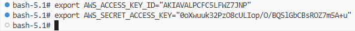
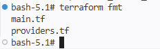
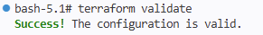
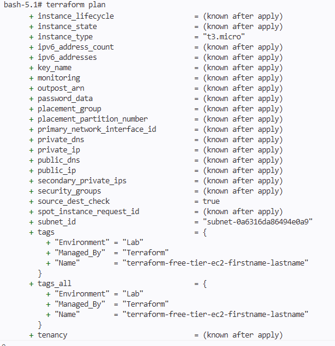
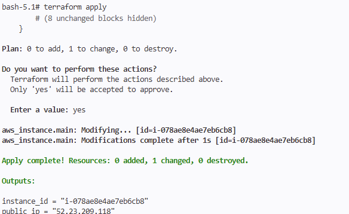
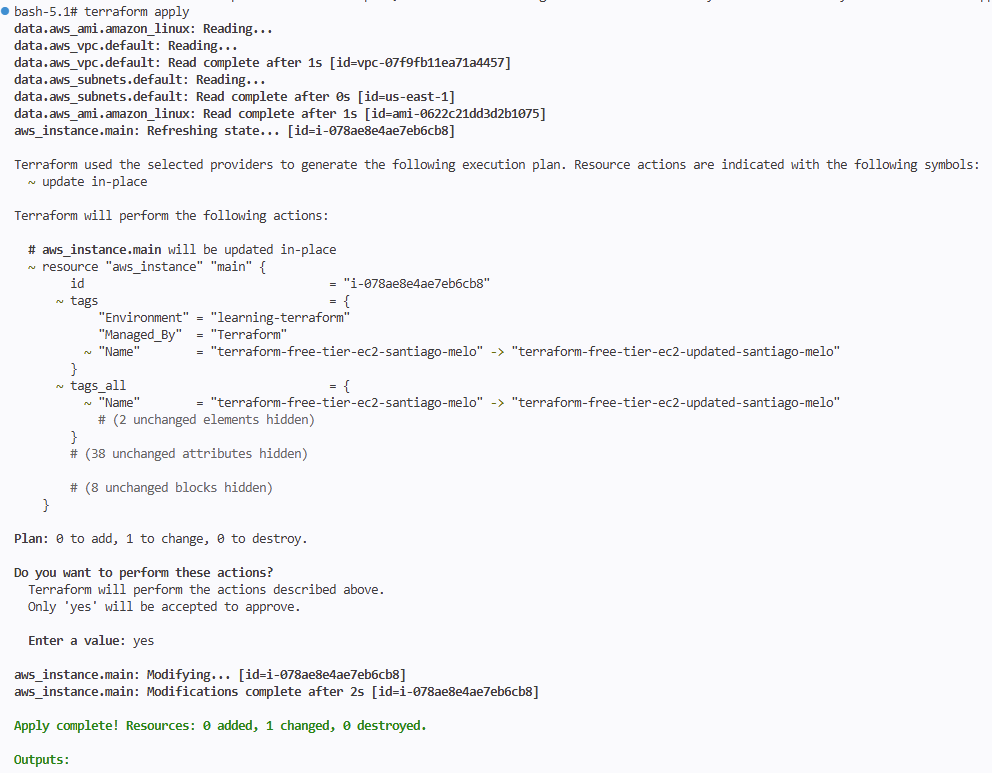
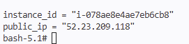

# LAB-02-AWS: Creating Your First AWS Resource

## Overview
In this lab, you will create your first AWS resource using Terraform: an Amazon EC2 instance. We will build upon the configuration files created in LAB-01, adding resource configuration and implementing the full Terraform workflow. The lab introduces environment variables for AWS credentials, resource blocks, and the essential Terraform commands for resource management.


## Prerequisites
- Terraform installed
- AWS CLI installed
- AWS account with appropriate permissions
- Completion of [LAB-01-AWS]

## Estimated Time
20 minutes

## Lab Steps

### 1. Navigate to Your Configuration Directory

Ensure you're in the terraform directory created in LAB-01:

```bash
pwd
/workspaces/Infra-as-Code/labs/aws/terraform
```
If you're in a different directory, change to the Terraform working directory:
```bash
cd labs/terraform
```

### 2. Configure AWS Credentials

Set your AWS credentials as environment variables:

```bash
export AWS_ACCESS_KEY_ID="your_access_key"
export AWS_SECRET_ACCESS_KEY="your_secret_key"
```



### 3. Add EC2 Resource Configuration

Open `main.tf` and add the following EC2 configuration (purposely not written in HCL canonical style).

Before writing the resource, choose your personal identifier using this format:
- `firstname-lastname`
- Example: `sara-palacios`

Use that value in the EC2 tag `Name` so we all create a clearly identifiable instance.

```hcl
# Find a recent Amazon Linux 2 AMI in your configured region
data "aws_ami" "amazon_linux" {
  most_recent = true
  owners = ["amazon"]

  filter {
    name = "name"
    values = ["amzn2-ami-hvm-*-x86_64-gp2"]
  }
}

# Obtain default VPC
data "aws_vpc" "default" {
  default = true
}

# Obtain default subnet inside the VPC
data "aws_subnets" "default" {
  filter {
    name   = "vpc-id"
    values = [data.aws_vpc.default.id]
  }

  filter {
    name   = "default-for-az"
    values = ["true"]
  }
}

# Create a Free Tier eligible EC2 instance
resource "aws_instance" "main" {
  ami           = data.aws_ami.amazon_linux.id
  instance_type = "t3.micro"
  subnet_id     = data.aws_subnets.default.ids[0]

  tags = {
    Name        = "terraform-free-tier-ec2-firstname-lastname"
    Environment = "Lab"
    Managed_By  = "Terraform"
  }
}


output "instance_id" {
  value = aws_instance.main.id
}

output "public_ip" {
  value = aws_instance.main.public_ip
}
```

### 4. Format and Validate

Format your configuration to rewrite it to follow HCL style:
```bash
terraform fmt
```


Validate the syntax:
```bash
terraform validate
```


### 5. Review the Plan

Generate and review the execution plan:
```bash
terraform plan
```

The plan output will show that Terraform intends to create a new EC2 instance with:
- A dynamically selected Amazon Linux 2 AMI
- Instance type `t3.micro` (Free Tier eligible in many accounts/regions)
- Three tags: Name, Environment, and Managed_By




### 6. Apply the Configuration

Apply the configuration to create the EC2 instance:
```bash
terraform apply
```

Review the proposed changes and type `yes` when prompted to confirm.

### 7. Verify the Resource

Review the EC2 instance creation using the AWS CLI:
```bash
aws ec2 describe-instances --filters "Name=tag:Name,Values=terraform-free-tier-ec2-firstname-lastname" --region=us-east-1 # Replace firstname-lastname with your identifier
```

### 8. Update the EC2 Instance Resource

In the `main.tf` file, update the EC2 configuration by changing a tag value:

```hcl
# Create a Free Tier eligible EC2 instance
resource "aws_instance" "main" {
  ami           = data.aws_ami.amazon_linux.id
  instance_type = "t3.micro"
  subnet_id     = data.aws_subnets.default.ids[0]

  tags = {
    Name        = "terraform-free-tier-ec2-firstname-lastname"
    Environment = "learning-terraform"  # <-- change tag here
    Managed_By  = "Terraform"
  }
}
```

### 9. Run a Terraform Plan to Perform a Dry Run

Generate and review the execution plan:
```bash
terraform plan
```

Since tags on an EC2 instance can be changed, the plan output will show that Terraform will make an update in-place:
- the tags on `aws_instance.main` will be updated

Expected Output:

```bash
aws_instance.main: Refreshing state... [id=i-xxxxx]

Terraform used the selected providers to generate the following execution plan. Resource actions are indicated with the following symbols:
  ~ update in-place

Terraform will perform the following actions:

  # aws_instance.main will be updated in-place
  ```

### 10. Apply the Configuration

Apply the configuration to update the EC2 instance tags:
```bash
terraform apply
```


Review the proposed changes and type `yes` when prompted to confirm.

### 11. Update the Tags on the EC2 Instance

In the `main.tf` file, update the EC2 configuration again by changing another tag value:

```hcl
# Create a Free Tier eligible EC2 instance
resource "aws_instance" "main" {
  ami           = data.aws_ami.amazon_linux.id
  instance_type = "t3.micro"
  subnet_id     = data.aws_subnets.default.ids[0]

  tags = {
    Name        = "terraform-free-tier-ec2-updated-firstname-lastname"  # <-- change tag here
    Environment = "learning-terraform"  # <-- change tag here
    Managed_By  = "Terraform"
  }
}
```

### 12. Run a Terraform Plan to Perform a Dry Run

Generate and review the execution plan:
```bash
terraform plan
```

Since the tags of an EC2 instance can be changed, the plan output will show that Terraform will make an update in-place:
- the tags on `aws_instance.main` will be updated

Expected Output:

```
aws_instance.main: Refreshing state... [id=i-xxxxxx]

Terraform used the selected providers to generate the following execution plan. Resource actions are indicated with the following symbols:
  ~ update in-place

Terraform will perform the following actions:

  # aws_instance.main will be updated in-place
  ```

### 13. Apply the Configuration


Apply the configuration to apply the latest EC2 tag updates:
```bash
terraform apply
```



Review the proposed changes and type `yes` when prompted to confirm.

## Verification Steps

Confirm that:
1. The EC2 instance exists in your AWS account with:
  - Instance type: `t3.micro`
  - A valid Amazon Linux 2 AMI
   - All specified tags present
2. A terraform.tfstate file exists in your directory
3. All Terraform commands completed successfully

## Success Criteria
Your lab is successful if:
- AWS credentials are properly configured using environment variables
- The EC2 instance is successfully created with all specified configurations
- All Terraform commands execute without errors
- The terraform.tfstate file accurately reflects your infrastructure

## Common Issues and Solutions

If you encounter credential errors:
- Double-check your environment variable values
- Ensure there are no extra spaces or special characters
- Verify your AWS user has appropriate permissions

If you encounter AMI lookup issues:
- Verify the AWS region in `provider "aws"` matches where you want to deploy
- Re-run `terraform plan` to refresh the AMI data source lookup
